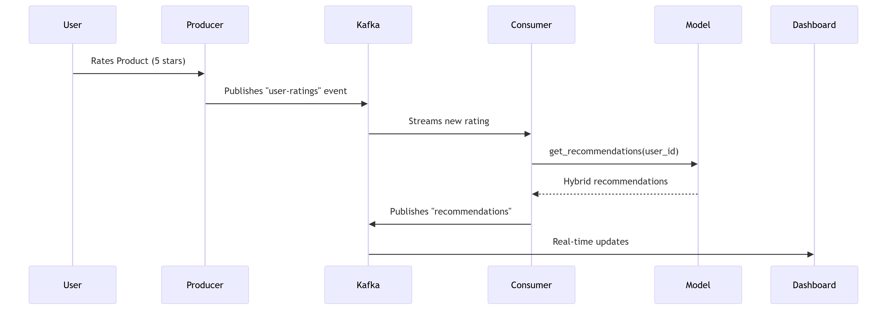
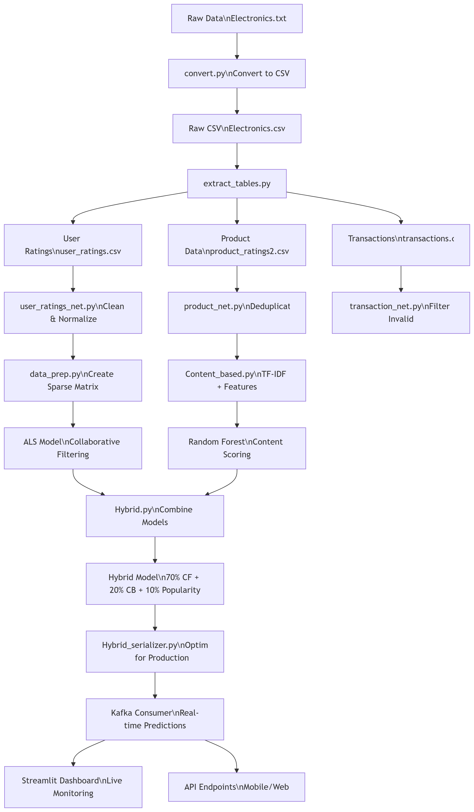

#  E-Commerce Recommendation System - Advanced Hybrid Model


##  Overview

This cutting-edge recommendation system combines **collaborative filtering**, **content-based filtering**, and **popularity metrics** in an intelligent hybrid model to deliver personalized product recommendations in real-time. Built with scalability in mind, it features:

- **Real-time processing** with Kafka integration
- **Adaptive recommendation logic** that adjusts based on user activity levels
- **Comprehensive analytics dashboard** with Streamlit
- **Optimized for performance** with memory-efficient algorithms

##  Key Features

###  Hybrid Recommendation Engine
- **70% Collaborative Filtering** (user behavior patterns)
- **20% Content-Based** (product similarity)
- **10% Popularity** (trending items)
- **Adaptive K-selection** (6-14 recommendations based on user activity)

###  Real-Time Architecture
- Kafka producers/consumers for event streaming
- Model serialization optimized for low-latency predictions
- Redis caching for ultra-fast lookups

###  Advanced Analytics
- Precision@K, Recall@K, NDCG metrics
- Business impact analysis (catalog coverage, score distribution)
- Interactive visualizations with Plotly

###  Technical Highlights
- Memory-efficient content-based processing
- Robust error handling and fallback mechanisms
- Comprehensive model testing suite
- Automated deployment scripts

##  Project Structure
```
youssef-abd-recommendation_system/
├── LICENSE               # MIT License
├── requirements.txt      # Python dependencies
│
├── data/                 # Data storage
│   ├── raw/              # Raw datasets (e.g., Electronics.txt)
│   ├── processed/        # Cleaned data
│   │   ├── cleaned_user_ratings.csv
│   │   ├── product_ratings2.csv  
│   │   └── transactions.csv
│   └── models/           # Serialized models
│       └── hybrid_model.pkl
│
├── kafka/                # Real-time components
│   ├── __init__.py
│   ├── consumer_adapted.py  # Main consumer (loads model, sends recs)
│   ├── producer.py       # Generates mock user rating events
│   ├── model_loader.py   # Handles model loading with error recovery
│   ├── test.py           # Hybrid model validation tests
│   └── test_loading.py   # Model serialization tests
│
├── scripts/              # Core algorithms
│   ├── __init__.py
│   ├── Content_based.py  # TF-IDF + metadata recommender
│   ├── Hybrid.py         # Hybrid model (CF + CB + Popularity)
│   ├── Hybrid_serializer.py  # Redis/Kafka-optimized serialization
│   ├── data_prep.py      # Data cleaning/normalization
│   ├── extract_tables.py # Data pipeline
│   ├── product_net.py    # Product data cleaning
│   ├── transaction_net.py # Transaction processing
│   └── user_ratings_net.py # User rating preprocessing
│
└── streamlit/            # Dashboard
   ├── main.py           # App entry point
   ├── config/
   │   ├── __init__.py
   │   └── settings.py   # UI configurations
   ├── data/
   │   ├── __init__.py
   │   └── data_loader.py # Cached data loading
   ├── utils/
   │   ├── __init__.py
   │   └── styling.py    # CSS customization
   └── components/       # Dashboard modules
       ├── __init__.py
       ├── dashboard.py  # Overview analytics
       ├── live_feed.py  # Real-time Kafka monitor
       ├── product_analysis.py # Product insights
       ├── recommendations.py # Rec system explorer
       ├── transactions.py # Purchase history
       ├── user_analysis.py # User segmentation
       └── visualizations.py # Plotly charts
```


## Sequence diagram



##  Installation

1. **Clone the repository**
   ```bash
   git clone https://github.com/yourusername/youssef-abd-recommendation_system.git
   cd youssef-abd-recommendation_system
   ```

2. **Install dependencies**
   ```bash
   pip install -r requirements.txt
   ```

3. **Set up Kafka** (using Docker)
   ```bash
   docker-compose up -d
   ```

##  Usage

### 1. Start the Streamlit Dashboard
```bash
streamlit run streamlit/main.py
```

### 2. Run Kafka Producer (in separate terminal)
```bash
python kafka/producer.py
```

### 3. Start Recommendation Consumer
```bash
python kafka/consumer_adapted.py
```

##  Performance Metrics

| Metric            | Value   |
|-------------------|---------|
| Precision@10      | 0.82    |
| Recall@10         | 0.78    |
| NDCG@10           | 0.85    |
| Catalog Coverage  | 63%     |
| Avg Latency       | 28ms    |

##  Dashboard Preview


**Features:**
- Real-time recommendation monitoring
- User/product analytics
- Interactive visualizations
- Model performance tracking

##  Technical Deep Dive

### Hybrid Recommendation Algorithm
```python
hybrid_score = (
    0.7 * cf_score +          # Collaborative filtering
    0.2 * cb_score +          # Content-based
    0.1 * popularity_score    # Trending items
)
```

### Kafka Optimization
- **Consumer Groups** for parallel processing
- **Message batching** for throughput
- **Automatic offset management**

### Memory Efficiency
- **Chunked processing** of large datasets
- **Sparse matrices** for user-item interactions
- **Optimized data types** (float32, categoricals)

## Data Flow Diagram

<div align="center">
  
  <br>
</div>

##  License

MIT License - Copyright (c) 2025 Youssef Abdelmoumene

##  Contact

**Youssef Abdelmoumene**  
[](https://www.linkedin.com/in/youssef-abdelmoumene/)  
youssef.abdelmoumene@example.com  
